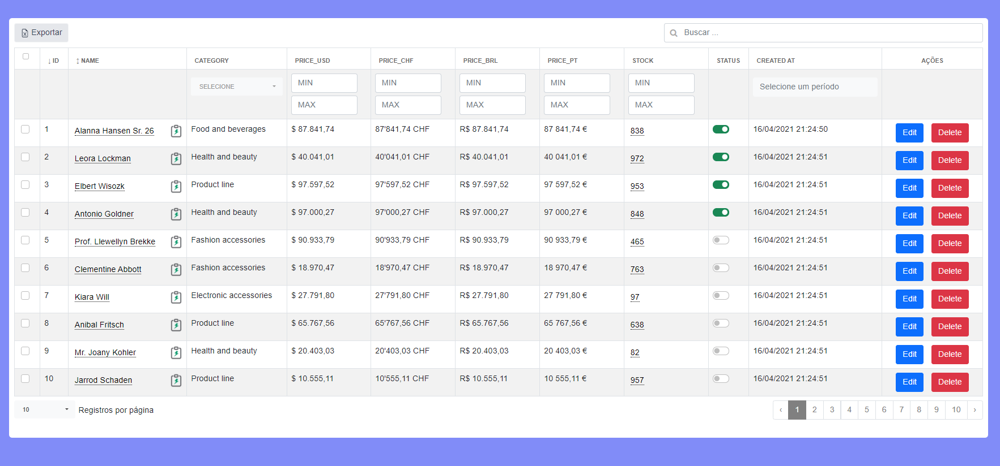

<div align="center">
	<p></p>
</div>

------

# Livewire PowerGrid

## What is Livewire PowerGrid?

Livewire PowerGrid is a component for [Laravel Livewire](https://laravel-livewire.com) used to generate dynamic tables for your Laravel Collections.

Out of the box Livewire PowerGrid component provides many features, such as:

- Searching & Filters
- Column Sorting
- Pagination
- Action checkboxes
- Action buttons
- Link on table cell
- Data Export to XLSx/Excel.

The component works with Bootstrap or Tailwind.

---

# Requirements

- [Laravel 8x](https://laravel.com/docs/8.x/installation)
- [Livewire 2x](https://laravel-livewire.com)
- Tailwind or bootstrap:
    - [Install Tailwindcss](https://tailwindcss.com/docs/guides/laravel)
    - [Install Bootstrap 5](https://getbootstrap.com/docs/5.0/getting-started/introduction/)

# Get started

## Installation

For the instalation guide we will create a `ProductTable` to list  products of a `Product` Model.

### 1. Via composer

To install via composer, run the following command:

```bash
  composer require power-components/livewire-powergrid
```

### 2. Add PowerGridServiceProvider to your Providers list

Open the file `config/app.php` and add the line bellow after your other providers:

```php
  PowerComponents\LivewirePowerGrid\Providers\PowerGridServiceProvider::class,
```

Your code should look similar to this:

```php
<?php

 //...
 
    'providers' => [
        //...
        PowerComponents\LivewirePowerGrid\Providers\PowerGridServiceProvider::class,       
    ];
```

### 3. Publish Config files

You can publish the Livewire PowerGrid configuration file with the following command:

```bash
    php artisan vendor:publish --tag=livewire-powergrid-config
```

### 4. [OPTIONAL] files

This step is option, you may skip it in case you don't need to customize Livewire PowerGrid.

You may publish the Livewire PowerGrid views and language files with the following commands:

Views:

```bash
    php artisan vendor:publish --tag=livewire-powergrid-views
```

Language files:

```bash
    php artisan vendor:publish --tag=livewire-powergrid-lang
```

### 5. Change the theme of your choice in config/livewire-powergrid.php

```html
    */
    'theme' => 'tailwind'
    /*
```

### 6. Include PowerGrid component

```html
    @powerGridStyles and @powerGridScripts
```

Make sure you have Livewired included too:

```html
    @livewireStyle and @livewireScripts
```

You can read more about this at the official [Livewire documentation](https://laravel-livewire.com/docs/2.x/quickstart)

---

### 7.  Creating a Table Component

To create a Table Component for an entity use the following Artisan command.

Make sure to use "" around your `--model` option.

```bash
    php artisan powergrid:create --name=ProductTable --model="App\Models\Product"
```

If everything was succesfull, you will find your new table component inside the `app/Http/Livewire` folder.

#### Options

| Option | Description | Example | 
|----|----|----|
|**--name**| Model name | ```--name=ProductTable``` |
|**--model**| Full model path | ```--model="App\Models\Product"``` |
|**--publish**| Publish stubs file into the path 'stubs' | ```--publish``` |
|**--template**| Sometimes you can use ready-made templates for creating different types of tables | ```php artisan powergrid:create --template=stubs/table.sub or php artisan powergrid:create --template=stubs/table_with_buttons.sub``` |

### 8.  Using your Table Component

The `ProductTable` component can be included in any view.

There are two ways to do that. Both work in the same way:

```html
    <livewire:product-table/>
```

or

```html
  @livewire('product-table')
```

---

# Configuring & Customizing your Table Component

_::: wip :::_

You can configure and customize your table component to adjust it to your needs.

Verify the following methodos:

- `setUp`
- `dataSource`
- `columns`
- `actions`

Example:

```php
    class ProductTable extends PowerGridComponent
    {
        use ActionButton;

        public function setUp()
        {
            $this->showCheckBox()->showPerPage()->showSearchInput();
        }
    
        public function dataSource(): array
        {
            $model = Product::query()->with('group')->get();
            return PowerGrid::eloquent($model)
                ->addColumn('id', function(Product $model) {
                    return $model->id;
                })
                ->addColumn('name', function(Product $model) {
                    return $model->name;
                })
                ->addColumn('group_id', function(Product $model) {
                    return $model->group_id;
                })
                ->addColumn('group_name', function(Product $model) {
                    return $model->group->name;
                })
                ->addColumn('created_at', function(Product $model) {
                    return $model->created_at;
                })
                ->addColumn('created_at_format', function(Product $model) {
                    return Carbon::parse($model->created_at)->format('d/m/Y H:i:s');
                })
                ->make();
        }
    
        public function columns(): array
        {
            return [
                Column::add()
                    ->title('ID')
                    ->field('id')
                    ->searchable()
                    ->sortable(),
    
                Column::add()
                    ->title('Descrição')
                    ->field('name')
                    ->searchable()
                    ->sortable(),
    
                Column::add()
                    ->title('GrupoID')
                    ->field('group_id')
                    ->hidden(),
    
                Column::add()
                    ->title('Grupo')
                    ->field('group_name')
                    ->makeInputSelect(Group::all(), 'name', 'group_id', ['live_search' => true ,'class' => ''])
                    ->searchable()
                    ->sortable(),
    
                Column::add()
                    ->title('Criado em')
                    ->field('created_at')
                    ->hidden(),
    
                Column::add()
                    ->title('Criado em')
                    ->field('created_at_format')
                    ->makeInputDatePicker('created_at')
                    ->searchable()
            ];
        }
    
        public function actions(): array
        {
            return [
                Button::add('edit')
                    ->caption('Editar')
                    ->class('btn btn-primary')
                    ->route('product.edit', ['product_id' => 'id']),
    
                Button::add('delete')
                    ->caption('Excluir')
                    ->class('btn btn-danger')
                    ->route('product.delete', ['product_id' => 'id']),
            ];
        }
    }
```

## Column Methods

_::: wip :::_

| Method | Arguments | Result | Example |
|----|----|----|----|
|**add**| |Add new column |```Column::add()```|
|**title**| *String* $title |Column title representing a field |```add()->title('Name')```|
|**field**| *String* $field | Field name| ```->field('name')```|
|**searchable**| |Includes the column in the global search | ```->searchable()``` |
|**sortable**| |Includes column in the sortable list | ```->sortable()``` |
|**headerAttribute**|[*String* $class default: ''], [*String* $style default: '']|Add the class and style elements to the column header|```->headerAttribute('text-center', 'color:red')```|
|**bodyAttribute**|[*String* $class default: ''], [*String* $style default: '']|Add the column lines the class and style elements|```->bodyAttribute('text-center', 'color:red')```|
|**html**| |When the field has any changes within the scope using Collection|```->html()```|
|**visibleInExport**| |When true it will be invisible in the table and will show the column in the exported file|```->visibleInExport(true)```|
|**hidden**| |hides the column in the table|```->hidden()```|
|**filterDateBetween**| [*String* $class default: 'col-3'] |Include a specific field on the page to filter between the specific date in the column|```Column::add()->filterDateBetween()```|
|**makeInputSelect**| [*Array* $data_source, *String* $display_field, *String* $relation_id, *Array* $settings] |Include a specific field on the page to filter a hasOne relation in the column|```Column::add()->makeInputSelect(Group::all(), 'name', 'group_id', ['live_search' => true ,'class' => ''])```|
|**editOnClick**| | Allows the column to be editable by clicking it |```Column::add()->editOnClick()```|
---

## Action Methods

_::: wip :::_

### Route

`->route(string, array)`

string = route name
array = route parameters, for example route resource: `Route::resource('products', 'ProductController');`

    array example:
        [
            'id' => 'id'
        ] 
    represents:
        [
            'parameter_name' => 'field' (to get value from this column) 
        ]
    in this case we will have:
        [
            'id' => 1
        ]

---

## Examples

Bootstrap version


Tailwind version


Exported example with selected data


## Support

If you need any support, please check our [Issues](https://github.com/Power-Components/livewire-powergrid/issues). You can ask questions or report problems there.

## Credits

- [Contributions](https://github.com/Power-Components/livewire-powergrid/pulls)
- [Online Logomaker](https://onlinelogomaker.com/logomaker/?project=50439167)
